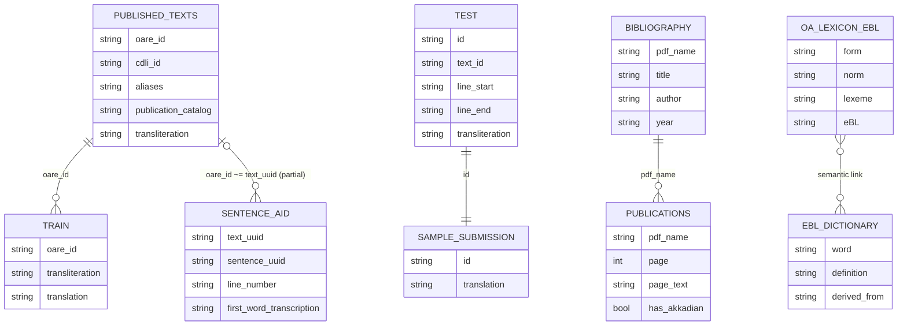

## コンペのCLIでの名前

```bash
deep-past-initiative-machine-translation
```

## データセット概要

このコンペは、**Old Assyrian の transliteration（転写）から英訳を生成する機械翻訳タスク**です。  
学習は主に `train.csv`、推論対象は `test.csv`、提出形式は `sample_submission.csv` に従います。  
`published_texts.csv`・`publications.csv`・辞書系CSVは、追加データ構築や前処理のための補助データです。

## 主要ファイルと役割

| file | 役割 | 主なキー/列 | ローカル件数（参考） |
|---|---|---|---:|
| `train.csv` | 教師あり学習の主データ（文書レベル） | `oare_id`, `transliteration`, `translation` | 1,561 |
| `test.csv` | 推論対象（文レベル） | `id`, `text_id`, `line_start`, `line_end`, `transliteration` | 4（サンプル） |
| `sample_submission.csv` | 提出テンプレート | `id`, `translation` | 4（サンプル） |
| `published_texts.csv` | OAREの公開転写＋メタデータ | `oare_id` と各種ID/URL列 | 7,953 |
| `Sentences_Oare_FirstWord_LinNum.csv` | 文アライメント補助 | `text_uuid`, `sentence_uuid`, `line_number` など | 9,782 |
| `publications.csv` | OCR由来の論文本文（ページ単位） | `pdf_name`, `page`, `page_text`, `has_akkadian` | 216,602 |
| `bibliography.csv` | 論文メタデータ | `pdf_name`, `title`, `author`, `year` など | 878 |
| `OA_Lexicon_eBL.csv` | 語彙正規化とeBLリンク | `form`, `norm`, `lexeme`, `eBL` | 39,332 |
| `eBL_Dictionary.csv` | eBL由来の辞書エントリ | `word`, `definition`, `derived_from` | 19,215 |
| `resources.csv` | 追加参考文献リスト | 文献情報列 | 292 |

## ER図（論理モデル）



## 関係性の実務的な解釈

1. `train.csv` と `published_texts.csv` は `oare_id` で接続可能です。  
   ローカル確認では `train` の `oare_id` は `published_texts` にすべて含まれていました。

2. `test.csv` と `sample_submission.csv` は `id` で1対1対応です。

3. `publications.csv` と `bibliography.csv` は `pdf_name` で接続します。  
   1つのPDFに複数ページがあるため、基本は **`bibliography` 1 : N `publications`** です。

4. `Sentences_Oare_FirstWord_LinNum.csv` の `text_uuid` は `oare_id` と一部のみ一致します。  
   厳密な外部キーではなく、文レベル整列の補助として使う想定です。

5. `OA_Lexicon_eBL.csv` と `eBL_Dictionary.csv` は厳密キーよりも語彙的対応（`word`/`lexeme`/`eBL`）で使います。

## モデリング時の注意点

1. `train` は文書レベル、`test` は文レベルで粒度が異なります。
2. `line_start` / `line_end` は文字列扱い（例: `1`, `1'`, `1''`）が必要です。
3. `published_texts.csv` の `oare_id` は少数重複があるため、完全一意前提での結合は避けるべきです。
4. `publications.csv` の先頭列名は BOM の影響で `\ufeffpdf_name` になることがあります。読み込み時に列名正規化を推奨します。
5. `cdli_id`、`aliases`、`publication_catalog`、`inventory_position` は `|` 区切りの複数値を含むため、必要なら正規化（explode）します。

## 追加学習データを作る際の流れ（要約）

1. `published_texts` のID群（`oare_id`, `cdli_id`, `aliases`）で対象文書を特定する。  
2. `publications.page_text` から翻訳候補を抽出し、英語へ統一する。  
3. 文分割後、`Sentences_Oare_FirstWord_LinNum` の情報も使って文対応を合わせる。  
4. `test` と同じ文レベル形式へ整形して学習データを拡張する。

## 参考にすべきURL
翻字変換
- https://oracc.museum.upenn.edu/doc/help/editinginatf/primer/inlinetutorial/index.html#Compound

